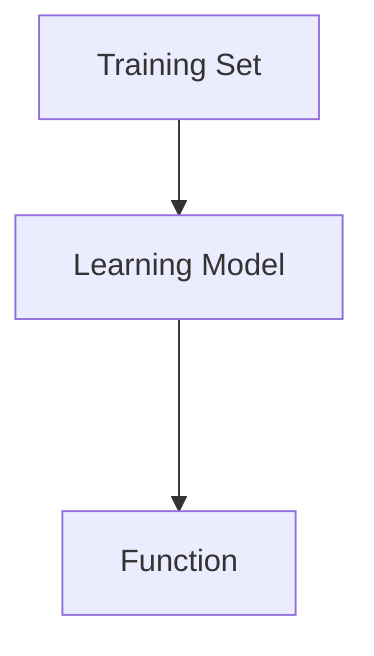
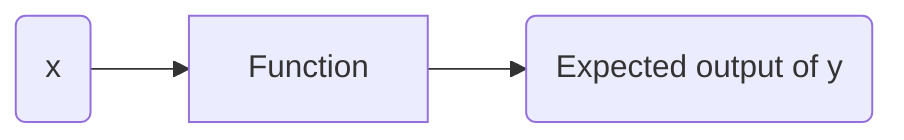
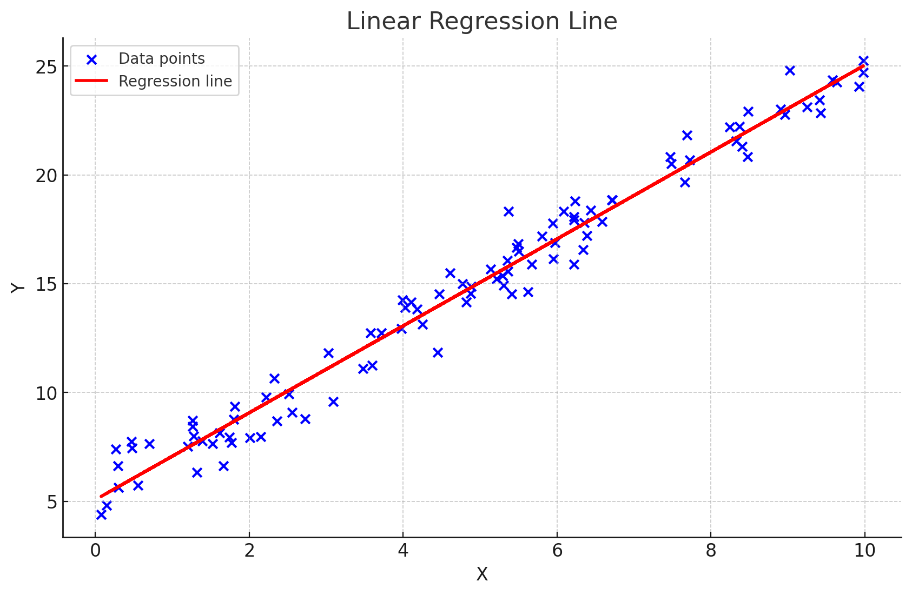

# Machine Learning

## Types of machine Learning
- Supervised
- Unsupervised
- Recommender systems
- Reinforcement Learning

## Supervised Learning
A bunch of input to output mappings are provided and the model is trained on them so that when the output is removed at one point, the machine can still predict the possible output in a reasonably accurate manner.  
This should work even for a brand new never-seen-before input.

Input(x)|Output(y)|Application
-|-|-|
email|spam(0/1)|spam filtering|
audio|text transcripts|speech recognition|
English|Spanish|machine translation|
ads, user information|click(0/1)|online advertising|
image, sensor info|position of other cars|self-drivingc car|
image of a phone|defect(0/1)|visual inspection|

**Some examples of Supervised Learning**  
Regression  
Classification  

### Regression and Classification Application
Regression|Classification|
----------|--------------|
Predict a number|Predict categories| 
from infinitely many possible outputs|from small number of possible outputs|
example: predicting housing prices based on land size| example: predicting whether a tumor is malignant or benign|

## Unsupervised Learning
Data comes with only inputs x, but no output labels y.

There is no supervision on what to look for, for example the output. The model recognises patterns or structures in the data on it's own.

For example: Google News uses the **clustering algorithm** to group related news articles together every day. 

**Some other examples of Unsupervised Learning Algorithms**
Algorithm|Use case
-|-
Clustering|Group similar data points together
Anomaly Detection| Detect unusual data points (for example: Financial system fraud detection, the unusual data point being an unusual transaction)
Dimensionality Reduction|Compress data using fewer numbers

# Jupyter Notebooks

## Linear Regression Model
Fitting a straight line to your data  

It predicts numbers as the output. Any supervised learning model that predicts numbers is addressing what's called a regression problem.
There are other models for addressing regression problems however.

In contrast to a regression model we have a classification model.  

## Classification Model
Predicts catgories or discrete categories (is a certain picture of a cat or not?)  

## Some common terminologies in ML

Terminology|What it means|
-|-|
Training set|Data used to train the model, consists of **features** and **targets**
input variable/input feature/feature|Input to a model
output variable/ target variable| Output that a model gives

## Notations
x = **input variable** or **feature** or **input feature**  
y = **output variable** or **output target** or **target**    
m = total number of training examples  
(x, y) = single training example  
(xi, yi) = ith training example

### Housing price example
s.n|size in ft (x)|price in $1000 (y)
-|-|-|
1|2122|400
2|1231|234
3|5433|315
4|2132|190
...|...|...
47|3210|870

Here,  
m = 47  
(x3, y3) = (5433, 315)

If x is the feature and y is the target,
The function takes in an input x and produces an estimate or prediction for y, represented as $\hat{y}$  

 **Note: The output produced by the function is not the target (y) but an estimation or prediction of the target that may or may not equal to the target.**

## How to represent f?
 A key concern when we design a learning algorithm is how we are we going to represent the function f.    

 That is, what is the mathematical formula that we are going to use to compute f?  

 Consider f is a straight line, then f can be represented as,      

 **fw,b(x) = wx + b**

 or, **f(x) = wx + b** simply.

 where, f is a function that takes x as input and outputs some value of a prediction $\hat{y}$, depending on the values of the parameters w and b.

 In ML, the parameters of a model are the variables that you can adjust during training in order to improve the model. Parameters are also referred to as coefficients or weights.

   

The red line represents the function f(x).

**We may also fit a non linear function such as a curve or a parbola as per need and the representation of the function changes accordingly.**  

Univariate linear regression = Lnear model with one input variable  

## Cost Function

